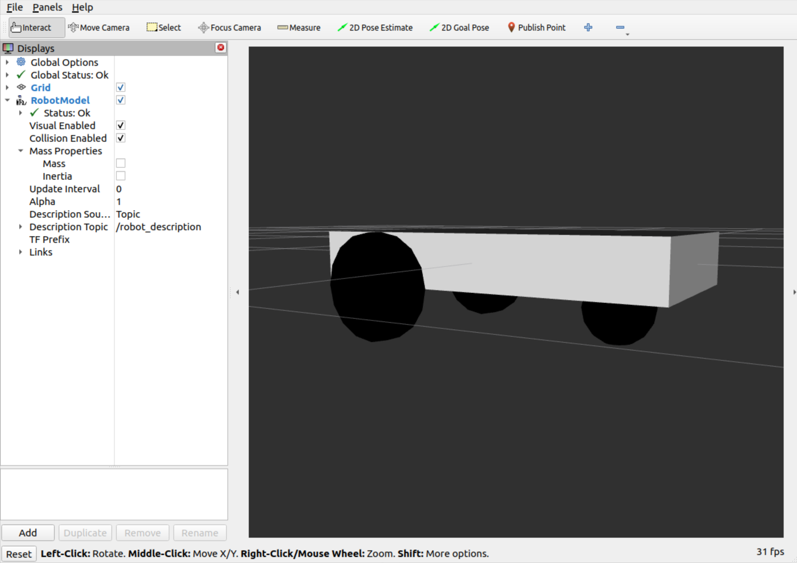

# DEScription temPLATEs

This repository contains various examples for how to template
description files in ROS 2. Each example demonstrates the
use of a **templating engine**, with a **description format**,
at **compile time** or **launch time**.

Templating engines:

* [🐍 EmPy](https://pypi.org/project/empy/)
* [💎 ERB](https://docs.ruby-lang.org/en/2.3.0/ERB.html)
* [📟 Xacro](http://wiki.ros.org/xacro)

Description formats:

* [🌐 URDF](https://wiki.ros.org/urdf)
* [🌱 SDF](http://sdformat.org/)

## Quick start

1. Install [ROS Humble](https://docs.ros.org/en/humble/Installation.html) or higher

1. Clone this repository:

    ```
    mkdir -p ~/ws/src
    cd ~/ws/src
    git clone https://github.com/chapulina/desplate
    ```

1. Install dependencies:

    ```
    cd ~/ws
    rosdep install --from-paths src --ignore-src -r -y
    ```

1. Build and install:

    ```
    cd ~/ws
    colcon build
    ```

1. Run one of the examples, i.e.:

    ```
    ros2 launch desplate_empy vehicle_sdf.launch.py
    ```

1. You should see a differential drive robot (like [dolly](https://github.com/chapulina/dolly)) on RViz:

    

1. Also try checking the inertia visualization (also set transparency to 0.5):

    

## Try out all examples

### Launch time

Generating description files at launch time is convenient if you're often
iterating on parameters for those files. If your files aren't changing much,
consider generating them at compile time to save some time every time you
launch.

Generating templates at launch file follows these steps:

1. Get the path to the template file, for example:

    https://github.com/chapulina/desplate/blob/a8b8ee40d91ddf1531cdbcda222b4d889bd4bb91/desplate_empy/launch/vehicle_sdf.launch.py#L30-L31

1. Use the templating engine to generate a file using the templating engine,
   and store it in a string variable.

1. Pass that description string to another node. For robots, that's usually
   `robot_state_publiser`, i.e.:

    https://github.com/chapulina/desplate/blob/a8b8ee40d91ddf1531cdbcda222b4d889bd4bb91/desplate_common/launch/visualize.launch.py#L40-L45

TODO: pass parameters at launch time

#### EmPy

Add these lines to a launch file in order to generate a description from an
EmPy template:

https://github.com/chapulina/desplate/blob/a8b8ee40d91ddf1531cdbcda222b4d889bd4bb91/desplate_empy/launch/vehicle_sdf.launch.py#L33-L36

Try it out:


* SDF

    `ros2 launch desplate_empy vehicle_sdf.launch.py`

* URDF

    `ros2 launch desplate_empy vehicle_urdf.launch.py`

#### ERB

Add this line to a launch file in order to generate a description from an
ERB template:

https://github.com/chapulina/desplate/blob/a8b8ee40d91ddf1531cdbcda222b4d889bd4bb91/desplate_erb/launch/vehicle.launch.py#L32-L33

Try it out:

* SDF

    `ros2 launch desplate_erb vehicle_sdf.launch.py`

* URDF

    `ros2 launch desplate_erb vehicle_urdf.launch.py`

#### Xacro

Add this line to a launch file in order to generate a description from a
Xacro template:

https://github.com/chapulina/desplate/blob/a8b8ee40d91ddf1531cdbcda222b4d889bd4bb91/desplate_xacro/launch/vehicle.launch.py#L33-L34

Try it out:

* SDF

    `ros2 launch desplate_xacro vehicle_sdf.launch.py`

* URDF

    `ros2 launch desplate_xacro vehicle_urdf.launch.py`

### Compile time

Generating description files at compile time is convenient if you're not
iterating on parameters for those files. If your files often take different
configurations, consider generating them at launch time.

#### EmPy

TODO

#### ERB

TODO

#### Xacro

TODO

## Compare

This package makes it possible to compare how the same result can be achieved
using different templating engines and description formats. You can use a tool
like [Meld](https://meldmerge.org/) to see these files side-by-side.

For example, to compare Xacro and EmPy:

TODO

Or to compare URDF and SDF:

TODO


