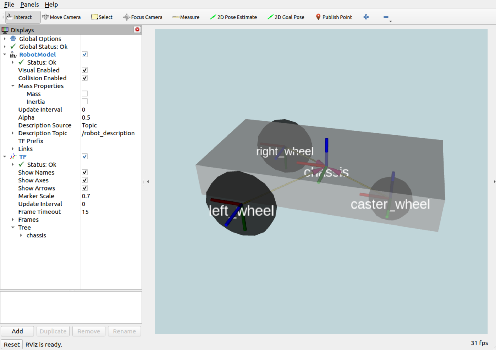
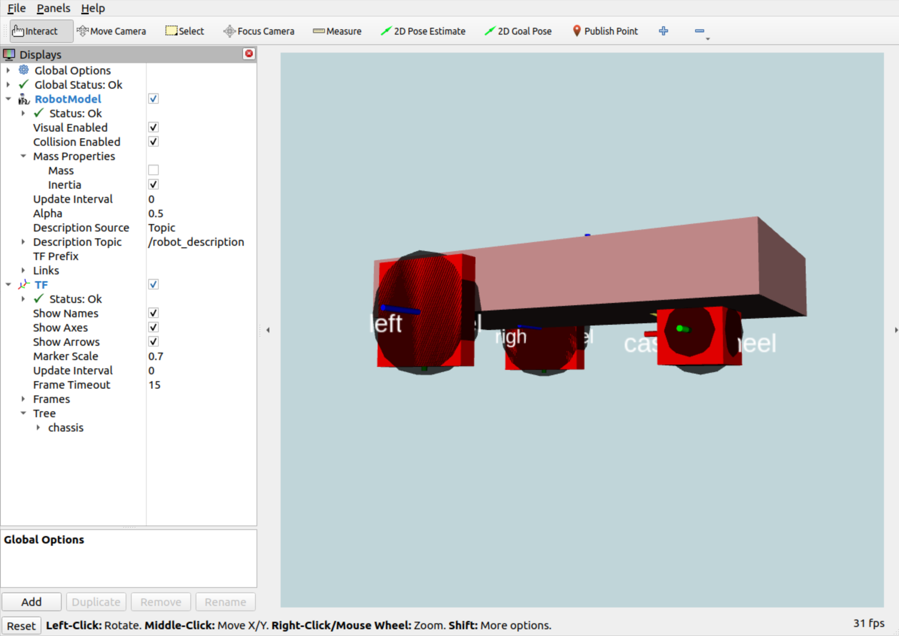

# DEScription temPLATEs

This repository contains various examples for how to template
description files in ROS 2. Each example demonstrates the
use of a **templating engine**, with a **description format**,
at **compile time** or **launch time**.

Templating engines:

* [🐍 EmPy](https://pypi.org/project/empy/)
* [💎 ERB](https://docs.ruby-lang.org/en/2.3.0/ERB.html)
* [📟 Xacro](http://wiki.ros.org/xacro)

Description formats:

* [🌱 SDF](http://sdformat.org/)
* [🌐 URDF](https://wiki.ros.org/urdf)

Is your engine or format of choice not represented? Consider opening a
pull request to add it!

## Quick start

1. Install [ROS Humble](https://docs.ros.org/en/humble/Installation.html) or higher

1. Clone this repository:

    ```
    mkdir -p ~/ws/src
    cd ~/ws/src
    git clone https://github.com/chapulina/desplate
    ```

1. Install dependencies:

    ```
    cd ~/ws
    rosdep install --from-paths src --ignore-src -r -y
    ```

1. Build and install:

    ```
    cd ~/ws
    colcon build
    ```

1. Run one of the examples, i.e.:

    ```
    ros2 launch desplate_empy vehicle_sdf_generate.launch.py
    ```

1. You should see a differential drive robot (like [dolly](https://github.com/chapulina/dolly)) on RViz:

    

1. Also try checking the inertia visualization:

    

## Try out all examples

Templating engine | Format | Generated when? | Command
------------------|--------|-----------------|--------
EmPy | SDF | launch | `ros2 launch desplate_empy vehicle_sdf_generate.launch.py`
EmPy | URDF | launch | `ros2 launch desplate_empy vehicle_urdf_generate.launch.py`
EmPy | SDF | compilation | `ros2 launch desplate_empy vehicle_sdf_installed.launch.py`
EmPy | URDF | compilation | `ros2 launch desplate_empy vehicle_urdf_installed.launch.py`
ERB | SDF | launch | `ros2 launch desplate_erb vehicle_sdf_generate.launch.py`
ERB | URDF | launch | `ros2 launch desplate_erb vehicle_urdf_generate.launch.py`
ERB | SDF | compilation | `ros2 launch desplate_erb vehicle_sdf_installed.launch.py`
ERB | URDF | compilation | `ros2 launch desplate_erb vehicle_urdf_installed.launch.py`
Xacro | SDF | launch | `ros2 launch desplate_xacro vehicle_sdf_generate.launch.py`
Xacro | URDF | launch | `ros2 launch desplate_xacro vehicle_urdf_generate.launch.py`
Xacro | SDF | compilation | `ros2 launch desplate_xacro vehicle_sdf_installed.launch.py`
Xacro | URDF | compilation | `ros2 launch desplate_xacro vehicle_urdf_installed.launch.py`

## How it works

### Launch time

Generating description files at launch time is convenient if you're often
iterating on parameters for those files. On the other hand, if your files
aren't changing much, consider generating them at compile time to save some
time every time you launch.

Generate templates at launch file following these steps:

1. Install all template files, i.e.:

    TODO

1. In a launch file, get the path to the installed template file, for example:

    https://github.com/chapulina/desplate/blob/a8b8ee40d91ddf1531cdbcda222b4d889bd4bb91/desplate_empy/launch/vehicle_sdf_generate.launch.py#L30-L31

1. Use the templating engine to generate a file and store it in a string variable.
   **See each engine below**.

1. Pass that description string to another node. For robots, that's usually
   `robot_state_publisher`, i.e.:

    https://github.com/chapulina/desplate/blob/a8b8ee40d91ddf1531cdbcda222b4d889bd4bb91/desplate_common/launch/visualize_generate.launch.py#L40-L45

TODO: pass parameters at launch time

#### EmPy

Add these lines to a launch file to generate a description from an
EmPy template:

https://github.com/chapulina/desplate/blob/a8b8ee40d91ddf1531cdbcda222b4d889bd4bb91/desplate_empy/launch/vehicle_sdf_generate.launch.py#L33-L36

#### ERB

Add this line to a launch file to generate a description from an
ERB template:

https://github.com/chapulina/desplate/blob/a8b8ee40d91ddf1531cdbcda222b4d889bd4bb91/desplate_erb/launch/vehicle_generate.launch.py#L32-L33

#### Xacro

Add this line to a launch file to generate a description from a
Xacro template:

https://github.com/chapulina/desplate/blob/a8b8ee40d91ddf1531cdbcda222b4d889bd4bb91/desplate_xacro/launch/vehicle_generate.launch.py#L33-L34

### Compile time

Generating description files at compile time is efficient if you're not
iterating on parameters for those files, because you're not generating them over
and over every time the application is launched. On the other hand, if your files
often take different arguments for each run, consider generating them at
launch time.

Generate templates at compile file following these steps:

1. Invoke the templating engine with CMake to generate the description into the
   `build` directory. See each engine below.

1. Install the generated description:

    TODO

1. In a launch file, find the installed description and store it in a string:

    TODO

1. Pass that description string to another node. For robots, that's usually
   `robot_state_publisher`, i.e.:

    https://github.com/chapulina/desplate/blob/a8b8ee40d91ddf1531cdbcda222b4d889bd4bb91/desplate_common/launch/visualize_generate.launch.py#L40-L45

#### EmPy

Add these lines to a CMake file to generate a description from an
EmPy template:

TODO

#### ERB

Add these lines to a CMake file to generate a description from an
ERB template:

TODO

#### Xacro

Add these lines to a CMake file to generate a description from a
Xacro template:

TODO

## Compare

This package makes it possible to compare how the same result can be achieved
using different templating engines and description formats. You can use a tool
like [Meld](https://meldmerge.org/) to see these files side-by-side.

For example, to compare Xacro and EmPy:

TODO

Or to compare URDF and SDF:

TODO


